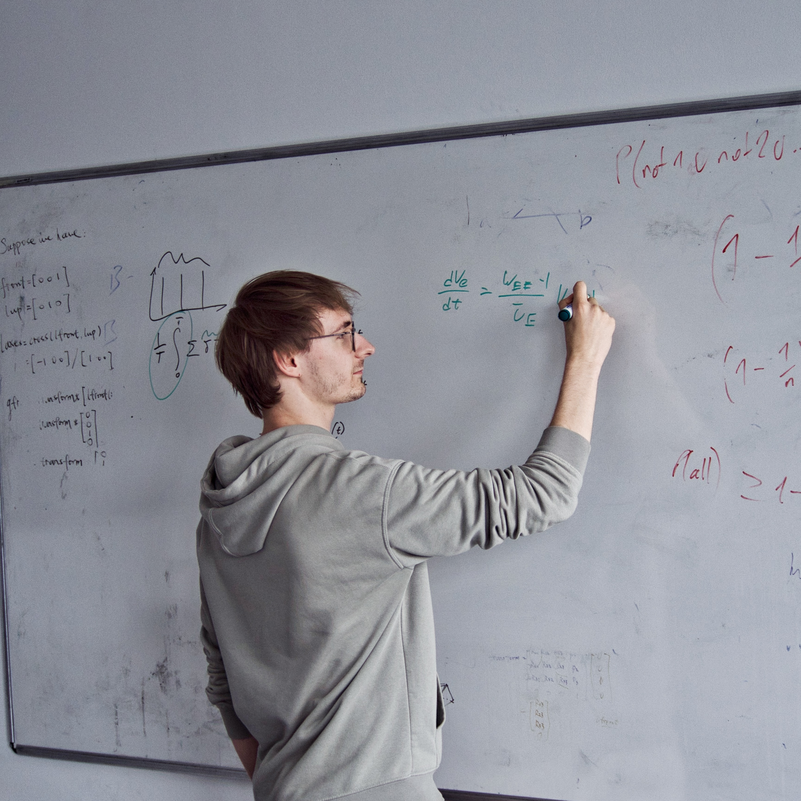

Hi! I'm Paul. I am a masters student in Informatics at the [University of Edinburgh](https://www.ed.ac.uk/). I am intersted in all things learning, of silicon and biological nature.

I have a strong background in Deep Learning, with my Bachelor's thesis on model compression achieving an 80% mark. For my Master's thesis I am currently researching optimisers for the distributed training of deep neural networks.

For more details, see my previous work [below](#previous-work).

When I'm not studying or researching deep learning methods, I am probably on a run🏃, taking photos📷 or hiking through the Scottish highlands⛰️.

## Research Interests
<!-- TODO: Links to intersting papers -->
- Foundational Deep Learning Methods  
    (Architectures, Training paradigms, Model compression, etc.)
- Computational Molecular Biology
- Computational Neuroscience: Biologically grounded models of cognition, behaviour and illnesses
- Natural Language Processing

## Current research

- Distributed optimisation of Deep Neural Networks.  
_Part of my Master's thesis with Hao Tang._

- Leveraging Graph Neural Networks (GNNs) for the automated determination of parameter sets for 3D meshes, particularly for a [novel spectral coarsening algorithm](https://arxiv.org/abs/2207.01146v2). This approach is aimed at expediting the computation of mesh parameters, to improve the efficiency of physics simulations on these meshes while maintaining a high level of accuracy. Previously, this task involved computationally expensive high-dimensional optimization methods, which the GNN method significantly accelerates.  
_Part of my research internship with Kartic Subr._

## Previous work
1. Cross-Architecture Knowledge Distillation techniques for models with mismatched output dimensions. \\
Bachelor's Thesis, supervised by [Hao Tang](https://homepages.inf.ed.ac.uk/htang2/). \\
_Achieved an 80% (A2)_. \\
[View PDF →](/documents/MInf1 - Paul Martin.pdf)  

2. Review of a Biologically Inspired Neural Network to Model PTSD and Eye Movement Desensitisation Reprocessing Therapy. \\
Coursework in Computation Cognitive Neuroscience, taught by Peggy Seriès. \\
_Achieved an 80% (A2)_. \\
[View PDF →](/documents/CCN Review - Paul Martin.pdf)

3. Bioinformatics Analysis of Autism-Related Gene Networks. \\
Coursework in Bioinformatics, taught by Ian Murray. \\
_Achieved a 79% (A3)_. \\
[View PDF →](/documents/BIO Autism Genes - Paul Martin.pdf)

Several other courseworks in Speech Processing, Computational Neuroscience, Machine Translation, etc. that achieved high marks of 80%+. While they're not explicitly research-oriented, they have contributed significantly to my academic background and expertise in these domains.

## Other experience
1. Teaching Assistant for [Machine Learning](http://www.drps.ed.ac.uk/23-24/dpt/cxinfr10086.htm) @2023/24

2. Research Assistant intern for [Kartic Subr](https://homepages.inf.ed.ac.uk/ksubr/), working on Graph Neural Networks for spectral coarsening of 3d meshes. @Summer 2023

3. Tutor for [Machine Learning](http://www.drps.ed.ac.uk/23-24/dpt/cxinfr10086.htm) @2022/23

4. Exchange year at the University of Hong Kong @2021/2022

## Favourite Courses
- Computational Neuroscience
- Natural Language Understanding, Generation, and Machine Translation \\
    _(What a long name 😄)_
- Automatic Speech Recognition
- Bioinformatics
- Quantum Information and Computation 
    _(Amazingly taught)_

---

<!-- TODO: Tab for photography -->
<!-- TODO: Tab for thesis -->